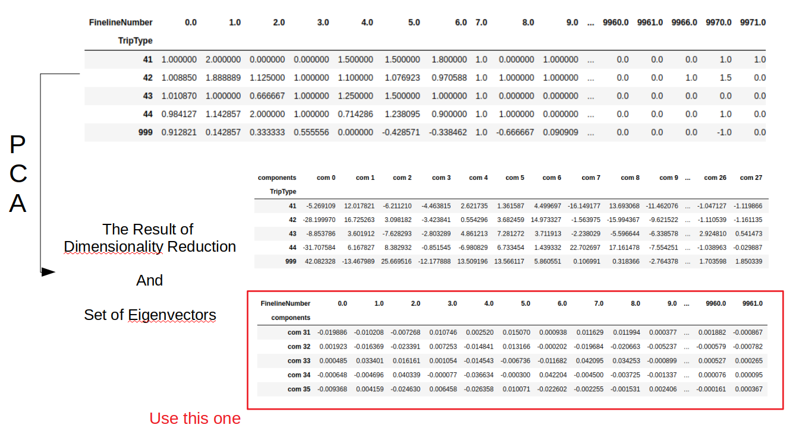
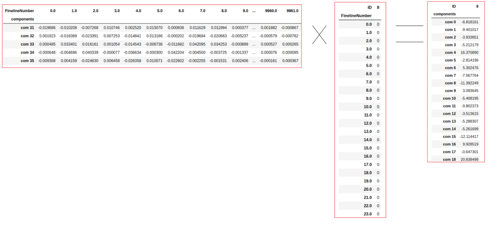
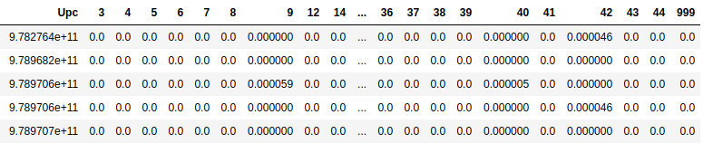

# Trip Type Classification
- Kaggle: https://www.kaggle.com/c/walmart-recruiting-trip-type-classification
- Used gradient boosting(`XGBoost`)
- Key features: **Weight > Upc > FinelineNumber > Department**

## Data Fields
- TripType - a categorical id representing the type of shopping trip the customer made. This is the ground truth that you are predicting. TripType_999 is an "other" category.
- VisitNumber - an id corresponding to a single trip by a single customer
- Weekday - the weekday of the trip
- Upc - the UPC number of the product purchased
- ScanCount - the number of the given item that was purchased. A negative value indicates a product return.
- DepartmentDescription - a high-level description of the item's department
- FinelineNumber - a more refined category for each of the products, created by Walmart

## Key concept
### 1. PCA
- Apply PCA to the DataFrame grouped by 'TripType'
- Please refer to `Model_EDA.ipynb` and pictures below:

<figure 1>

<figure 2>

### 2. Weight
- Apply weight using `Upc, FinelineNumber` info.
- Groupby('TripType'), PCA  and get weight
- Please refer to `Apply_Weight_EDA.ipynb` for the details.
- eg. Part of upc_weigth `DataFrame`(X axis: TripType, Y axis: Upc info.)

